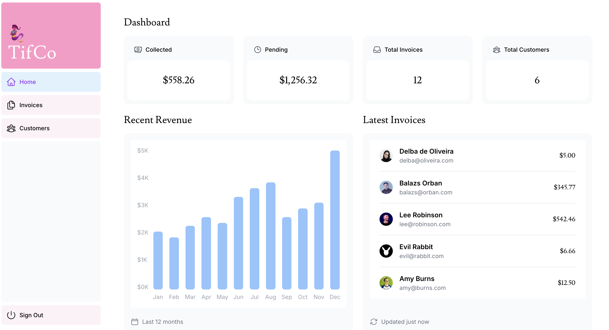

<p align="center">
  
</p>
<h1 align="center"><i>TifCo Dashboard</i></h1>

<p align="center">
  <a>
    
  </a>
  <a>
    
  </a>
  <a>
    
  </a>
  <a>
    
  </a>
  <a>
    
  </a>
</p>

This is a dashboard project I built to learn more about NextJS, Tailwind, React, Vercel, and a few other tools. It's pretty basic but fun to put together.

It's a React frontend with Next.js and Tailwind for styling. Deployed on Vercel and using their Postgres for storage. It has auth, is fully responsive, and is a great base for me to add more interesting features.

## Overview

TifCo Dashboard is a web application for managing invoices and customers. Built with Next.js 15, React 19, and TypeScript, it features authentication, real-time data updates, and a responsive design.

## Tech Stack

- **Framework**: Next.js 15 (App Router)
- **Language**: TypeScript
- **Styling**: Tailwind CSS
- **Database**: Vercel Postgres
- **Authentication**: NextAuth.js
- **Deployment**: Vercel
- **Package Manager**: pnpm

## Features

- Secure authentication system
- Dashboard with revenue analytics
- Invoice management (create, edit, delete)
- Customer management with payment history
- Fully responsive design
- Server-side rendering and optimized data fetching
- Real-time data synchronization

## Getting Started

### Prerequisites

- Node.js 20.12.0 or higher
- pnpm (recommended) or npm
- PostgreSQL database (or Vercel Postgres)

### Installation

Clone the repository:
```bash
git clone https://github.com/Nostromos/tifco.git
cd tifco
```

Install dependencies:
```bash
pnpm install
```

Set up environment variables:
```bash
cp .env.example .env.local
```

Seed the database (optional):
Visit `/seed` in your browser after starting the development server.

Run the development server:
```bash
pnpm dev
```

Open [http://localhost:3000](http://localhost:3000) in your browser.

### Production Build

```bash
pnpm build
pnpm start
```

## Project Structure

```
tifco/
├── app/                      # Next.js App Router
│   ├── dashboard/           # Dashboard pages
│   │   ├── (overview)/     # Main dashboard
│   │   ├── customers/      # Customer management
│   │   └── invoices/       # Invoice management
│   ├── lib/                # Utilities and data fetching
│   ├── ui/                 # React components
│   └── login/              # Authentication page
├── public/                  # Static assets
├── auth.config.ts          # NextAuth configuration
└── middleware.ts           # Authentication middleware
```

## Screenshots

<details>
<summary>Landing Page</summary>


</details>

<details>
<summary>Login Page</summary>


</details>

<details>
<summary>Dashboard Page/Home</summary>


</details>

<details>
<summary>Invoices Page</summary>


</details>

<details>
<summary>Create/Edit Invoice Page</summary>


</details>

<details>
<summary>Customers Page</summary>


</details>

## Development Status

### Completed
- [x] Setup
- [x] Styling (Tailwind)
- [x] Font & Image optimization
- [x] Layouts & pages
- [x] Navigation & pagination
- [x] Deployment & DB setup
- [x] Fetching data
- [x] Static/dynamic rendering
- [x] Streaming
- [x] PPR (Partial Prerendering)
- [x] Search & pagination
- [x] Data mutation
- [x] Error handling
- [x] Accessibility
- [x] Authentication
- [x] Metadata
- [x] MVP Complete

### Future Enhancements
- [ ] Customer portal
- [ ] User profile & preferences
- [ ] SEO improvements
- [ ] Custom reporting
- [ ] RBAC (Role-based access control)
- [ ] Dashboard builder (drag & drop)
- [ ] Custom queries

## Available Scripts

- `pnpm dev` - Start development server
- `pnpm build` - Build for production
- `pnpm start` - Start production server
- `pnpm lint` - Run ESLint

## License

This project is open source and available under the [MIT License](LICENSE).

## Acknowledgments

Built with inspiration from the Next.js Learn Course and dedicated to [@supsui](https://instagram.com/supsui).